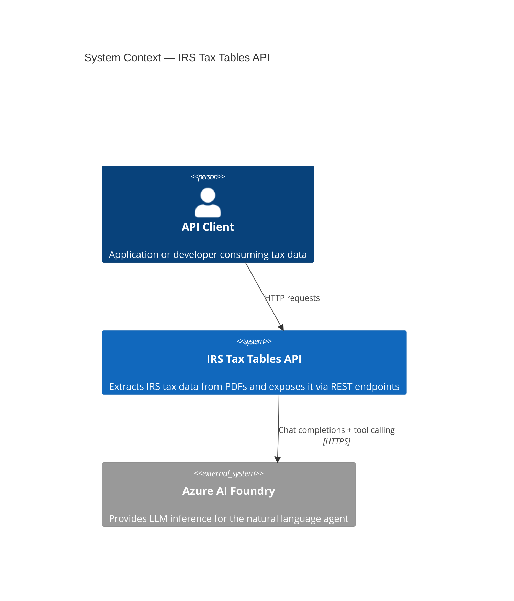
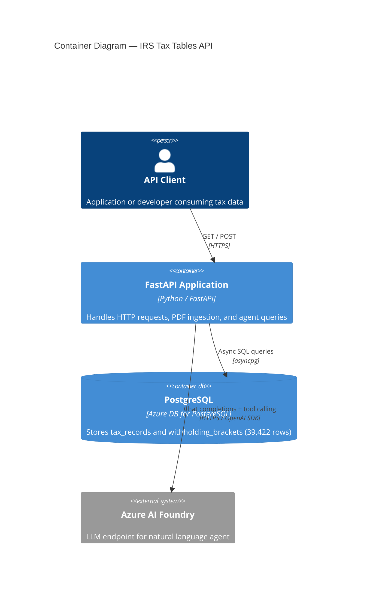
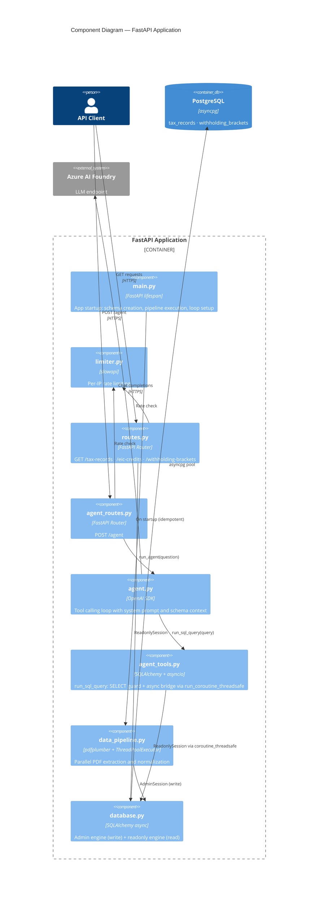

# C4 Architecture Diagram

## Level 1 — System Context

```mermaid
C4Context
    title System Context — IRS Tax Tables API

    Person(client, "API Client", "Application or developer consuming tax data")

    System(api, "IRS Tax Tables API", "Extracts IRS tax data from PDFs and exposes it via REST endpoints")

    System_Ext(azure_ai, "Azure AI Foundry", "Provides LLM inference for the natural language agent")

    Rel(client, api, "HTTP requests")
    Rel(api, azure_ai, "Chat completions + tool calling", "HTTPS")

    UpdateLayoutConfig($c4ShapeInRow="3", $c4BoundaryInRow="1")
```

## Level 2 — Containers

```mermaid
C4Container
    title Container Diagram — IRS Tax Tables API

    Person(client, "API Client", "Application or developer consuming tax data")

    Container(app, "FastAPI Application", "Python / FastAPI", "Handles HTTP requests, PDF ingestion, and agent queries")
    ContainerDb(db, "PostgreSQL", "Azure DB for PostgreSQL", "Stores tax_records and withholding_brackets (39,422 rows)")
    System_Ext(azure_ai, "Azure AI Foundry", "LLM endpoint for natural language agent")

    Rel(client, app, "GET / POST", "HTTPS")
    Rel(app, db, "Async SQL queries", "asyncpg")
    Rel(app, azure_ai, "Chat completions + tool calling", "HTTPS / OpenAI SDK")

    UpdateLayoutConfig($c4ShapeInRow="3", $c4BoundaryInRow="1")
```

## Level 3 — Components

```mermaid
C4Component
    title Component Diagram — FastAPI Application

    Person(client, "API Client")
    ContainerDb(db, "PostgreSQL", "asyncpg", "tax_records · withholding_brackets")
    System_Ext(azure_ai, "Azure AI Foundry", "LLM endpoint")

    Container_Boundary(app, "FastAPI Application") {
        Component(main, "main.py", "FastAPI lifespan", "App startup: schema creation, pipeline execution, loop setup")
        Component(limiter, "limiter.py", "slowapi", "Per-IP rate limiting")
        Component(routes, "routes.py", "FastAPI Router", "GET /tax-records · /eic-credits · /withholding-brackets")
        Component(agent_routes, "agent_routes.py", "FastAPI Router", "POST /agent")
        Component(agent, "agent.py", "OpenAI SDK", "Tool calling loop with system prompt and schema context")
        Component(agent_tools, "agent_tools.py", "SQLAlchemy + asyncio", "run_sql_query: SELECT guard + async bridge via run_coroutine_threadsafe")
        Component(pipeline, "data_pipeline.py", "pdfplumber + ThreadPoolExecutor", "Parallel PDF extraction and normalization")
        Component(database, "database.py", "SQLAlchemy async", "Admin engine (write) + readonly engine (read)")
    }

    Rel(client, routes, "GET requests", "HTTPS")
    Rel(client, agent_routes, "POST /agent", "HTTPS")
    Rel(routes, limiter, "Rate check")
    Rel(agent_routes, limiter, "Rate check")
    Rel(routes, database, "ReadonlySession")
    Rel(agent_routes, agent, "run_agent(question)")
    Rel(agent, azure_ai, "Chat completions", "HTTPS")
    Rel(agent, agent_tools, "run_sql_query(query)")
    Rel(agent_tools, database, "ReadonlySession via coroutine_threadsafe")
    Rel(database, db, "asyncpg pool")
    Rel(main, pipeline, "On startup (idempotent)")
    Rel(pipeline, database, "AdminSession (write)")
```
